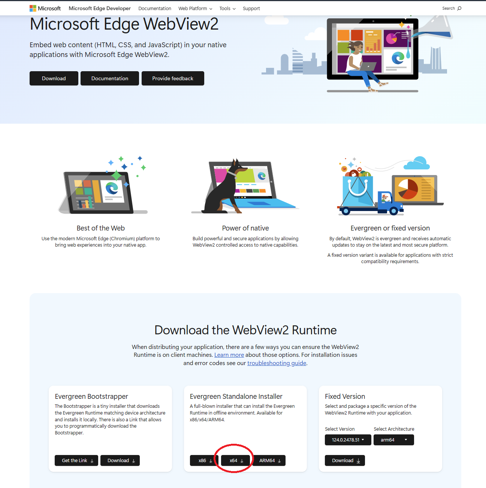

### These are instructions for installing Release-Candidate #1 of AV-Bible 2024

#### Requirements:

- Windows 11 (x64 -- System Type: 64-bit -- as revealed by \<System Information\> app, found via Windows Start-Menu)
- Several manual steps (Microsoft-Store app/installer will be released later; these manual steps are required to run RC1)

Here is a Microsoft thingie that unlocks some functionality of AV-Bible 2024, including the ability to view help files in the app:

https://developer.microsoft.com/en-us/microsoft-edge/webview2/ 

To run the test release of AV-Bible-2024 ...

**STEP #1:**

Install WebView2, by going to https://developer.microsoft.com/en-us/microsoft-edge/webview2/ and scrolling down to "Evergreen Standalone Installer" (x64).

**STEP #2:**

Download this "zip file": 
https://github.com/kwonus/AVBible/raw/omega/Test-Release-Zipfile-Install/AV-Bible-2024.zip

**STEP #3**

Extract the contents of the "zip file" to a folder (Right-click on downloaded zip file and select \<Extract All\>

It might default to a folder named AV-Bible-2024 in downloads; that works, or it can be save to any folder.

Wherever it is extracted to, that is where you can run it from.

**STEP #4**

The program name is "AV-Bible" in the AV-Bible-2024 folder. Double-click it to run it.

**Once it is running ...**

You should be able to view help files by clicking on the help menu pull-down:

(Should you want to delete the application, just delete the entire folder where you extracted it to; it's pretty small and does not take up much space)